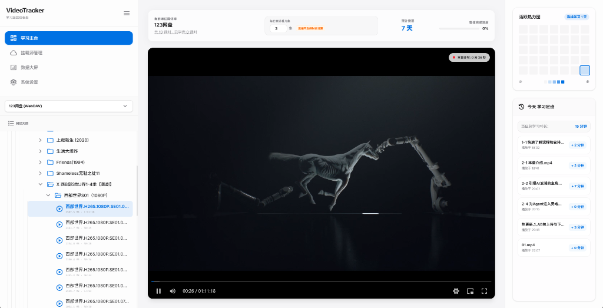
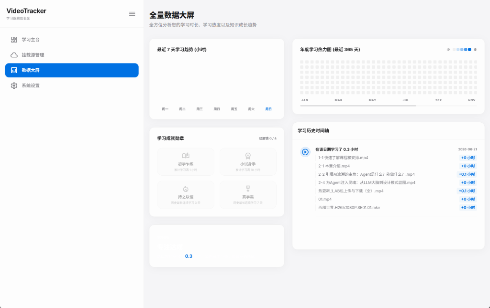
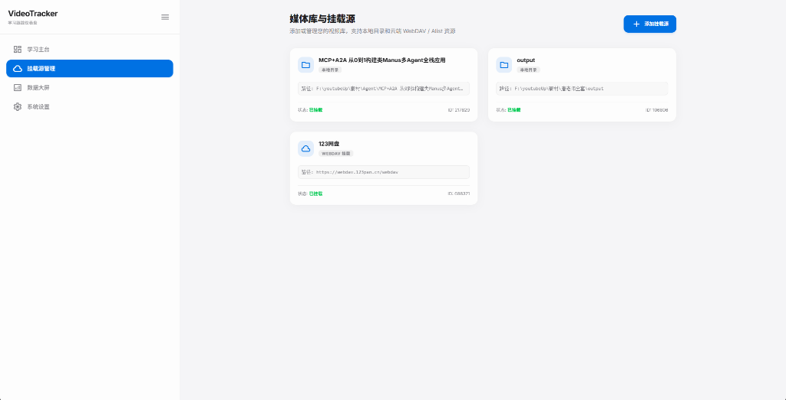
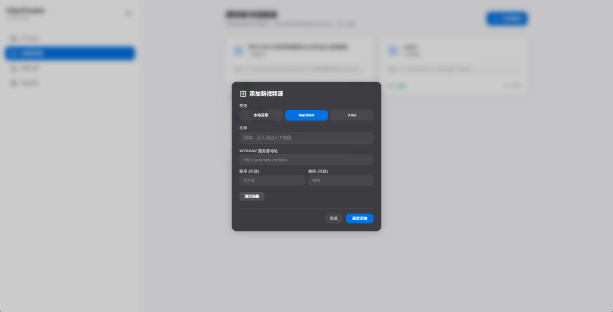
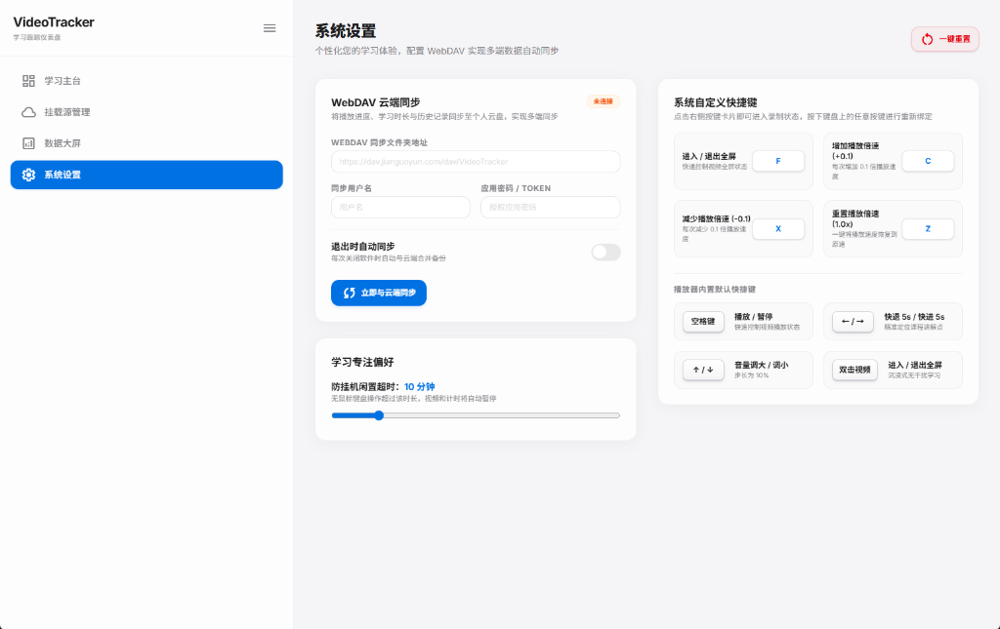

<h1 align="center">🎬 VideoTracker</h1>

<p align="center">
  <strong>专为自学者打造的视频学习进度追踪与数据分析仪表盘</strong>
</p>

<p align="center">
  
  
  
  
  
</p>

---

## 📖 简介

**VideoTracker (视频学习进度追踪器)** 是一款基于 Electron + React 19 + TypeScript + Tailwind CSS v4 打造的桌面端视频学习进度管理与分析大屏。

专为自学者设计，支持本地文件夹与 WebDAV / Alist 挂载源，提供精准的视频播放计时（含防挂机闲置暂停）、GitHub 风格学习热力图、多维度学习成就与学完进度预测，让您的学习时间可量化、可视化。

## 🖼️ 界面预览

以下截图基于当前版本截取，提供极简现代的毛玻璃（Glassmorphism）视觉风格：

| 学习主台 (播放界面) | 全量数据大屏 |
|---|---|
|  |  |

| 媒体库与挂载源 | 添加挂载源弹窗 |
|---|---|
|  |  |

| 系统设置 |
|---|
|  |

## ✨ 功能特性

### 📂 挂载与管理
- **多数据源挂载** — 支持添加本地视频文件夹、WebDAV（如坚果云）及 Alist（可连接各种网盘）挂载源
- **灵活浏览** — 左侧边栏多数据源快速切换，支持树状目录 / 平铺列表双模式浏览
- **播放列表定制** — 支持按文件名排序、乱序以及随机播放模式

### 🎬 播放与计时
- **高性能播放器** — 内嵌 ArtPlayer 5 播放内核，自动记忆播放进度，支持原生画中画（PiP）模式
- **精准学习计时** — 播放时自动计时，进入画中画模式或切换应用时计时正常进行
- **防挂机检测** — 闲置超时（无键鼠操作）自动暂停视频并停止计时，确保学习数据真实有效

### 📊 数据可视化
- **日历热力图** — 提供 GitHub 风格的年度 365 天学习热力图与最近 7 天学习趋势柱状图
- **学习足迹** — 包含今日详细学习足迹历史、学习时间轴，以及多维度学习成就勋章解锁系统
- **进度预测** — 结合当前倍速与每日目标，智能计算已学百分比及预计学完天数

### ⚙️ 同步与自定义
- **云端同步** — 支持配置 WebDAV 云端备份与同步，实现多设备间无缝共享学习进度
- **快捷键绑定** — 默认支持 F（全屏）、C/X/Z（倍速微调），可在设置页面完全自定义绑定按键并持久化保存

## 🏗️ 技术架构

```
VideoTracker/
├── src/
│   ├── main/                 # Electron 主进程 (窗口管理与 IPC)
│   │   ├── index.ts          #   主进程入口
│   │   └── preload.ts        #   IPC 预加载脚本
│   └── renderer/             # 渲染进程 (React 19 + TypeScript)
│       ├── App.tsx           #   根组件、全局状态与快捷键绑定
│       ├── index.css         #   全局样式 (Tailwind CSS v4)
│       ├── components/       #   UI 组件 (Dashboard, Sidebar, Player, Settings)
│       └── services/         #   服务层 (storage.ts 本地数据持久化)
├── package.json
├── vite.config.ts
└── README.md
```

### 技术栈

| 技术 | 版本 | 用途 |
|---|---|---|
| **Electron** | 42 | 跨平台桌面端应用容器 |
| **React** | 19 | 前端 UI 渲染框架 |
| **TypeScript** | 6 | 类型安全与接口契约 |
| **Vite** | 8 | 极速前端构建工具 |
| **Tailwind CSS** | v4 | 原子化 CSS 与极简暗色毛玻璃样式 |
| **ArtPlayer** | 5 | 高性能内嵌视频播放内核 |
| **lucide-react** | 1.x | 现代矢量图标库 |

## 🚀 快速开始

### 环境要求
- Node.js >= 18
- Git

### 安装与运行
```bash
# 1. 克隆仓库
git clone https://github.com/zzf-857/VideoTracker.git
cd VideoTracker

# 2. 安装依赖并启动 (Windows 下也可双击 run.bat 一键运行)
npm install
npm run dev
```

### 生产打包
```bash
npm run build
```

## ⌨️ 快捷键说明

| 快捷键 | 功能 |
|---|---|
| `F` | 切换全屏 / 退出全屏 |
| `C` | 播放倍速 +0.1x |
| `X` | 播放倍速 -0.1x |
| `Z` | 重置播放倍速为 1.0x |

> 💡 提示：所有快捷键均可在 **系统设置 → 快捷键设置** 中进行自定义绑定。

## 📁 数据存储

| 数据类型 | 存储路径 / 说明 |
|---|---|
| **本地数据** | `%APPDATA%/VideoTracker/` (包含视频进度、学习时长、快捷键绑定等 JSON 数据) |
| **云端同步** | 在 **系统设置** 中配置 WebDAV 即可实现多端自动/手动同步备份 |

## 🤝 贡献

欢迎提交 Issue 和 Pull Request！

## 📄 许可证

本项目基于 [MIT License](LICENSE) 开源。
