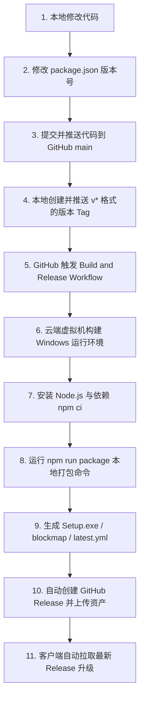
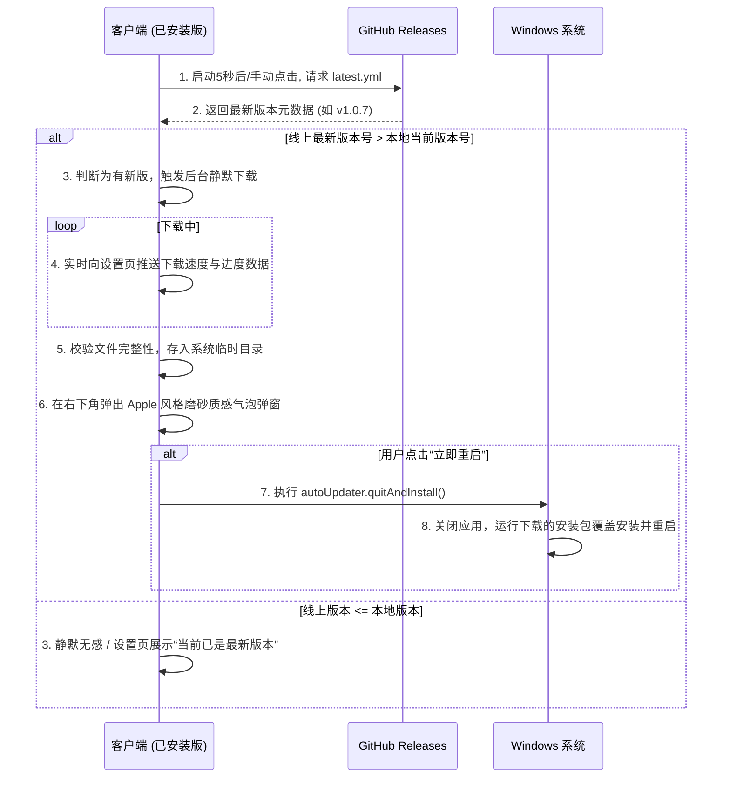

# VideoTracker 自动发布与客户端自动更新手册

本手册详细阐述了 **Git 推送 GitHub 触发 Actions 自动构建打包** 以及 **客户端后台静默检测与升级安装** 的完整运行逻辑与操作指南。

---

## 1. 自动构建与发布总览逻辑 (Mermaid 流程图)



---

## 2. GitHub Actions 自动打包原理

本项目的 GitHub Actions 流水线定义在项目目录下的 [.github/workflows/release.yml](file:///f:/AI/AIMadeupTools/01_DesktopApps/VideoTracker/.github/workflows/release.yml) 文件中。

### 触发条件 (`on:`)
流水线只在有 **符合 `v*` 格式的 Git 标签（Tag）被推送到 GitHub** 时才会触发（例如 `v1.0.6`，`v2.0.0` 等）：
```yaml
on:
  push:
    tags:
      - 'v*'
```

### 云端打包过程步骤解密
1. **启动虚拟机**：GitHub 启动一个干净的 `windows-latest` 云端虚拟机。
2. **检出代码**：使用 `actions/checkout` 拉取当前 Tag 的所有项目代码。
3. **环境初始化**：配置 Node.js 运行环境（版本 20），并启用 `npm` 依赖缓存加速。
4. **安全安装依赖**：运行 `npm ci`（依据 `package-lock.json` 安装完全一致的生产依赖）。
5. **执行打包**：运行 `npm run package`（即 `electron-builder`），在云端生成：
   * `VideoTracker-Setup-X.X.X.exe` (安装版安装包)
   * `VideoTracker-X.X.X.exe.blockmap` (增量更新包，用于检测差异加速下载)
   * `latest.yml` (核心版本元数据，包含版本号、sha512 文件哈希及安装包文件名)
6. **发布 Releases 资产**：使用 `softprops/action-gh-release`，利用 GitHub 提供的安全授权凭证（`GITHUB_TOKEN`），自动在仓库 of Releases 页面创建一个草稿/正式版本，并将上述三个文件作为资产上传。

---

## 3. 具体操作指南（如何发布新版本）

当您在本地开发完毕，准备对外发布一个新版本（例如 `v1.0.7`）时，请严格按照以下步骤操作：

### 步骤 1：修改本地版本号
打开项目根目录下的 [package.json](file:///f:/AI/AIMadeupTools/01_DesktopApps/VideoTracker/package.json) 文件，将 `"version"` 字段修改为您要发布的版本：
```json
{
  "name": "videotracker",
  "version": "1.0.7",  // <--- 修改此处
  ...
}
```

### 步骤 2：提交修改并推送至主分支
在终端（Git Bash 或 PowerShell）中执行以下命令，将代码同步至 GitHub 的 `main` 分支：
```bash
git add .
git commit -m "feat: 新增某某功能，升级版本至 1.0.7"
git push origin main
```

### 步骤 3：创建本地标签并推送
创建一个与 `package.json` **完全一致** 且以 `v` 开头的 Tag，并将其推送到远程：
```bash
# 创建带备注的本地 Tag
git tag -a v1.0.7 -m "VideoTracker v1.0.7 Release"

# 推送 Tag 到远程（此操作会立刻触发 GitHub 上的自动打包流）
git push origin v1.0.7
```

> [!TIP]
> 推送 Tag 后，您可以打开浏览器访问您的 GitHub 仓库 `https://github.com/zzf-857/VideoTracker/actions` 页面，即可实时看到一个名为 `Build and Release` 的流水线正在运行。大约 4-6 分钟后，在 GitHub 的 Releases 页面便会自动出现该版本及安装包。

---

## 4. 客户端内置自动更新原理

客户端使用 `electron-updater` 机制与您上传到 GitHub Releases 的 `latest.yml` 进行对接。

### 4.1 自动检查与更新时序



### 4.2 便携版 (Portable) 与开发环境的防御性设计
为了防止在便携版或本地开发时触发自动更新覆盖产生不可预知的错误，我们在代码中加入了以下防御逻辑：

1. **便携版防御**：
   * **识别方法**：通过检测是否存在环境变量 `process.env.PORTABLE_EXECUTABLE_DIR`（仅在便携版运行时由打包层注入）。
   * **行为表现**：若为便携版，更新检测直接被主进程拦截，返回状态 `portable`。设置页会友好提示：*“当前为便携版，请前往 GitHub 手动下载最新版”*。
2. **开发环境（Dev）防御**：
   * **行为表现**：在 `npm run dev` 模式下运行，自动更新检测接口会被直接拦截并返回“开发环境跳过更新”，防止本地调试时读取不到配置文件报错。

---

## 5. 本地开发调试自动更新方法

由于更新必须对比“本地版本”和“线上版本”，如果您想在本地测试更新气泡弹出的完整体验，可以利用“版本降级法”：

1. **降低版本号**：将本地的 `package.json` 修改为较低的版本（如 `"version": "1.0.0"`）。
2. **本地打包**：在本地终端运行打包命令：
   ```bash
   npm run package
   ```
3. **运行测试**：双击运行生成的绿色未安装程序：
   `F:\AI\AIMadeupTools\01_DesktopApps\VideoTracker\dist-package\win-unpacked\VideoTracker.exe`
4. **观察效果**：
   * 启动 5秒后，应用会自动识别本地为 `1.0.0`，而 GitHub Releases 线上最新是 `1.0.6`。
   * 它会在后台默默下载。当您打开「系统设置」时，会看到“正在下载更新包...”的进度条。
   * 下载完成后，您的屏幕右下角会自动弹出精美的大气泡通知提示您“立即重启”。
   * 点击“立即重启”后，将直接启动最新正式版的安装过程，并在安装后自动启动运行。
